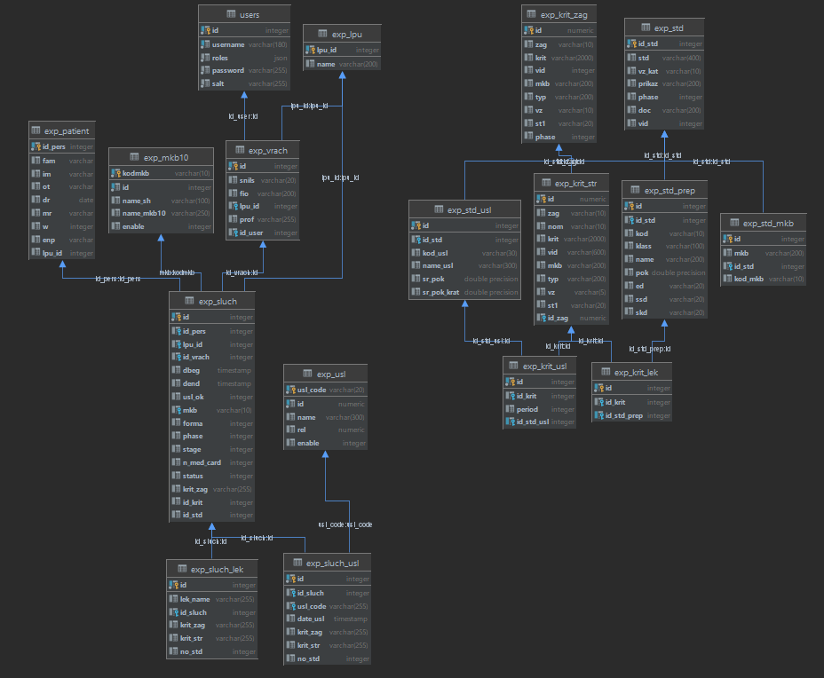

## Требования к серверу

Postgresql 12
PHP 7.4 + Composer

## Установка
1. Клонировать проект
2. Выполнить команду composer install
3. Развернуть дамп базы данных из папки db
4. Настроить подключение к базе данных в файле .env

## Данные для авторизации
#### Роль врача
Логин `doctor` пароль `doctor`

#### Роль врача-эксперта
Логин `expert` пароль `expert`

## Схема базы данных

